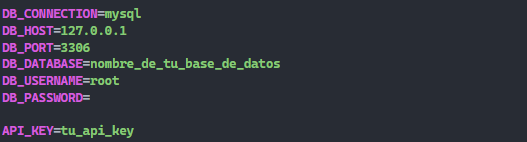

# Prueba Tecnica de Laravel y Angular 
 
# 🚀 Guía de Instalación de Proyectos

Este documento te guiará paso a paso para instalar y ejecutar los proyectos de Laravel y Angular.

# Indicaciones generales

- Clonar el proyecto de GitHub el cual contiene el backend y el fronted.

   📌 https://github.com/Carlos-Leguizamo/PruebaTecnicaDevLaravel

# 🖥️ **Proyecto Laravel**

# Requisitos:

- PHP
- Composer

### 1. Instalar dependencias
- composer install

### 2. Configuración de la base de datos y API key

👉 Abre el archivo .env

- Configura la variable DATABASE_URL con los datos locales de tu base de datos.

  

### 3. Ejecuta migraciones

- php artisan migrate

### 4. Inicia el servidor

- php artisan serve

# 🖥️ **Proyecto Angular**

### 1. Instalar dependencias
npm install

### 2. Iniciar servidor 

ng serve --open

## Sintaxis de las Urls de la api

📌 Si deseas hacer pruebas desde postman u otra herramineta, esta es la erstructura de las url de la api

- urlBackend/api/crear-alumno
- urlBackend/api//consultar-alumno/{grado}

## Recomendaciones

⚡  Verifica en el service de Agular que este apuntadno a tu url en la cual esta corriendo tu backend.

